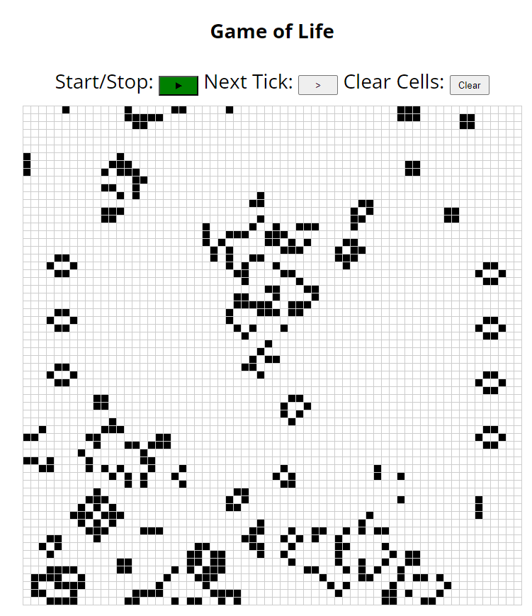

# WASM Game of Life
A basic implementation of the game of life based on [this guide](https://rustwasm.github.io/docs/book).
The goal of this project was to get familiar with web assembly and the ecosystem.
## Features
- Pause/Play button
- Tick by tick animation
- Interactive cells that can be toggled by clicking
## Example Screenshot
